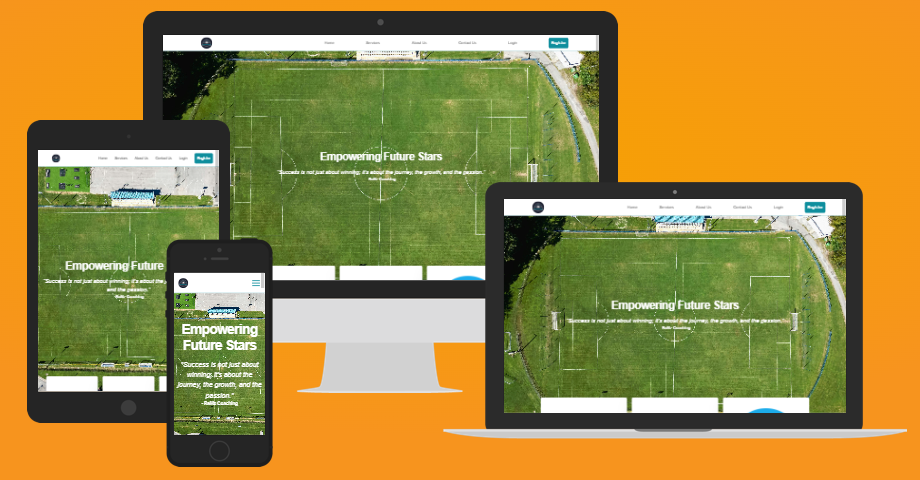
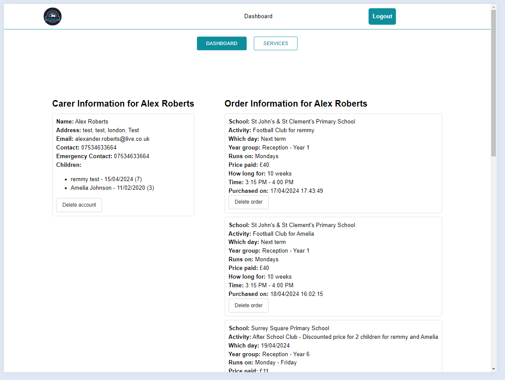
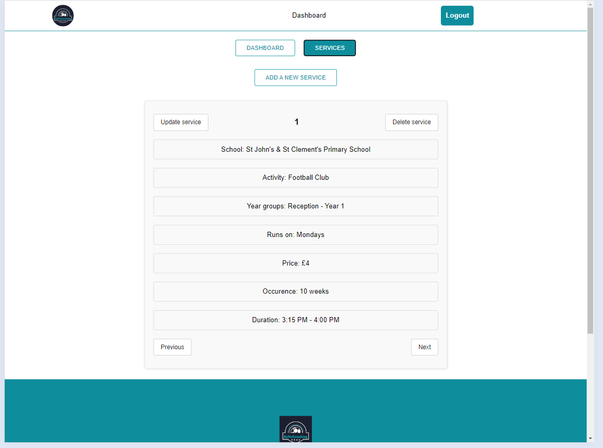
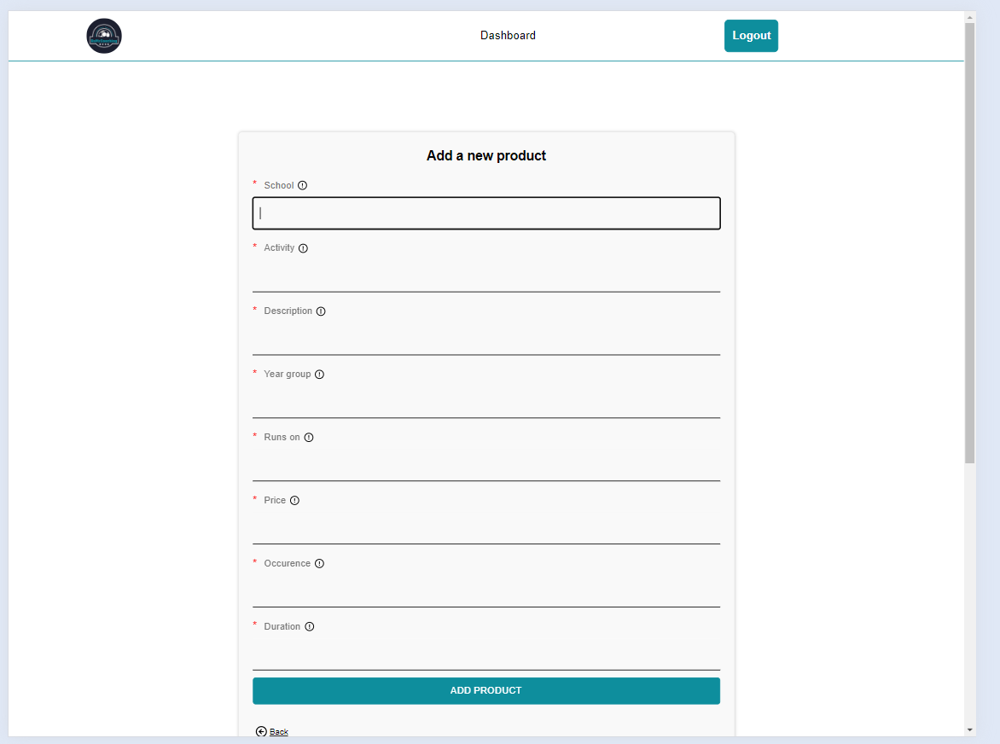
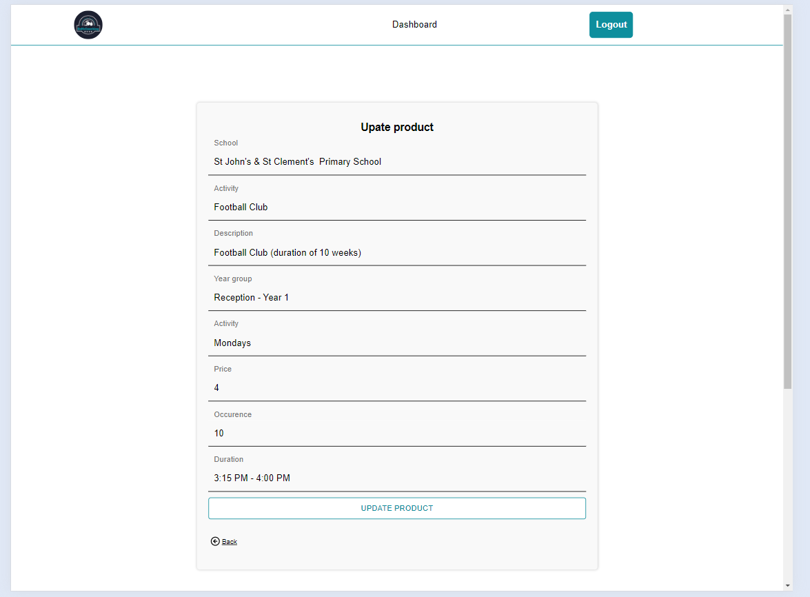

# ReMz Coaching

### **[View Demo](https://remzcoaching-frontend.vercel.app/)**

A prototype website for my friends' football coaching company offering various services and user management. Admins have additional privileges such as managing users and services.

### Technologies Used

- Frontend: React, Axios, React Hook Form, React Router DOM, yup, antd, Custom Hooks, Authorisation Context
- Backend: Node.js, Express
- Database: MySQL
- Payment Processing: Stripe

### Features

User Authentication

- **Purpose:** Ensure secure access to the platform and control user access based on roles and permissions
- **Description:** Provides functionalities for user registration, login, logout, password reset, and user profile management. Implements authentication/authorization middleware for protected routes, ensuring only authenticated users can access certain functionalities

CRUD Functionalities

- **Purpose:** Enable users to manage their profiles and allow admins to perform essential management tasks
- **Description:** Users can update their profile details and delete their profiles, empowering them to maintain accurate and up-to-date information. Admins have the authority to delete users' orders and accounts, create new services, update existing services, and remove services that are no longer offered

Stripe Integration

- **Purpose:** Facilitate secure and seamless payment processing for services offered on the platform
- **Description:** Integrates Stripe payment gateway to enable users to make payments for services they purchase. Ensures secure handling of payment transactions and provides a smooth checkout experience

Responsive design

- **Purpose:** Enhance user experience by ensuring the website is accessible and functional across various devices and screen sizes
- **Description:** Utilizes responsive design principles to adapt the layout and content of the website dynamically based on the device used to access it. Ensures consistent usability and visual appeal regardless of the device being used

Email Notifications

- **Purpose:**Keep users informed about important actions and events related to their accounts and transactions
- **Description:** Utilizes Nodemailer to send automated emails to users for various scenarios, including service purchases, password management (forget and reset), registration, and account deletion. Enhances user communication and engagement by providing timely notifications

Reset Total Spaces

- **Purpose:** Ensure the availability of booking spaces is regularly maintained and refreshed
- **Description:** Implements a scheduled task using cron job functionality to automatically reset the total available spaces for all products every Monday at 6am. Ensures that users have access to booking spaces on a regular and consistent basis

### Screenshots

- I will include screenshots of the admin page and its associated functionality

### License

This project is licensed under the MIT License - see the [LICENSE](LICENSE) file for details.
